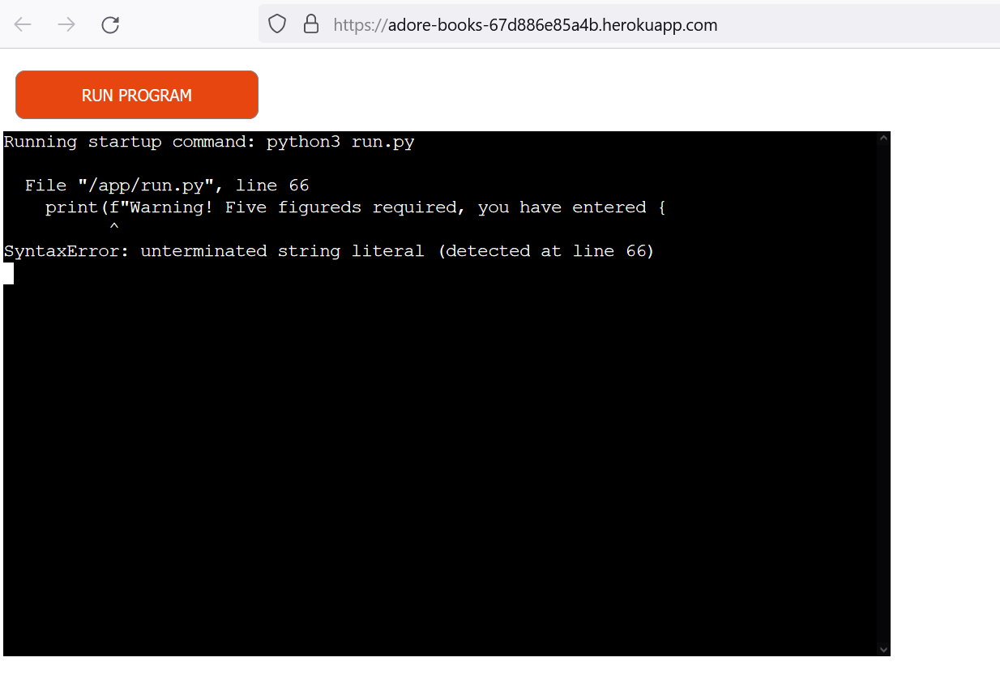

# Adore Books
This is a python program which enables the user to enter data and update a google spreadsheet for a fictional publishing house. It enters the data and performs calculations for the user.

## User Stories
- As someone with little/no experience with computers, I need clear instructions for this program
- As a publisher, I need to be able to perform calculations on my sales for different genres of books in one go
- As a business owner, I need to be able to calculate my total profits based on my sales and returned goods
- As a publishing house, I need to be able to calculate the total royalties I owe to authors

## How to Use
- On running the program, the user will be prompted to enter the sales data, consisting of five numbers in order of the book genre. These numbers should be separated by a comma only, with no blank spaces.
- Next the user will be asked to enter the returns data, in the same format as before.
- Both of these operations will check if the data is valid and transform the data from a string into an integer so it can be used in mathematical operations.
- The information will be logged to the spreadsheet before the calculations occur.
- First the program will find the profit for each genre by sorting the two input lists into sets, and subtracting the returns values from the sales values. Since the sales and returns figures are the number of books total, the resulting figure is multiplied by 12, which is the cost of a book in euros. This data will then be logged in the spreadsheet.
- Lastly the program will calculate how much is owed in author's royalties, by multiplying the profits figure by 0.15 to get 15% of the total profit. This set of numbers will also be recorded on the spreadsheet.

## Features
- Prompts user input and validates the entered data
 - It will not accept anything other than five numbers which can be converted into integers
- Converts the data into a list of integers
- Performs two calculations based on the data
    - Calculates the total profit by subtracting the returns from the sales, then multiplying that figure by the cost of a book.
    - Calculates the royalties owed by multiplying the profits figure by 0.15
- Updates a google spreadsheet with the data input

### Future Features
- Refactoring the `get_sales()` and `get_profits()` functions into one function, as the code is largely identical.

## Testing
- Code was run through the [Code Institute Python Linter](https://pep8ci.herokuapp.com/)

### Bugs
- As I was coding this program, I kept having trouble with the `python3 run.py` command to test the code in my chosen code editor, VSCode. As I could not get it to work in my terminal I used the inbuilt run and debug option to run my code locally. I also installed Microsoft's Python and Pylance extensions to allow me to import the required dependencies from my Python installation.
- My terminal kept giving a warning that my scripts were not on `PATH`. I resolved this by manually adding my Python install to my `PATH` environment variable using [this tutorial.](https://superuser.com/questions/143119/how-do-i-add-python-to-the-windows-path)
- My `validate_num` function was missing an argument, resulting in an error when it was passed an argument by the `get_sales` function
- VSCode ceased recognising the gspread import
- Heroku flagged several errors when the program is run
    

## Credits
- Code Institute's deployment terminal and sample README